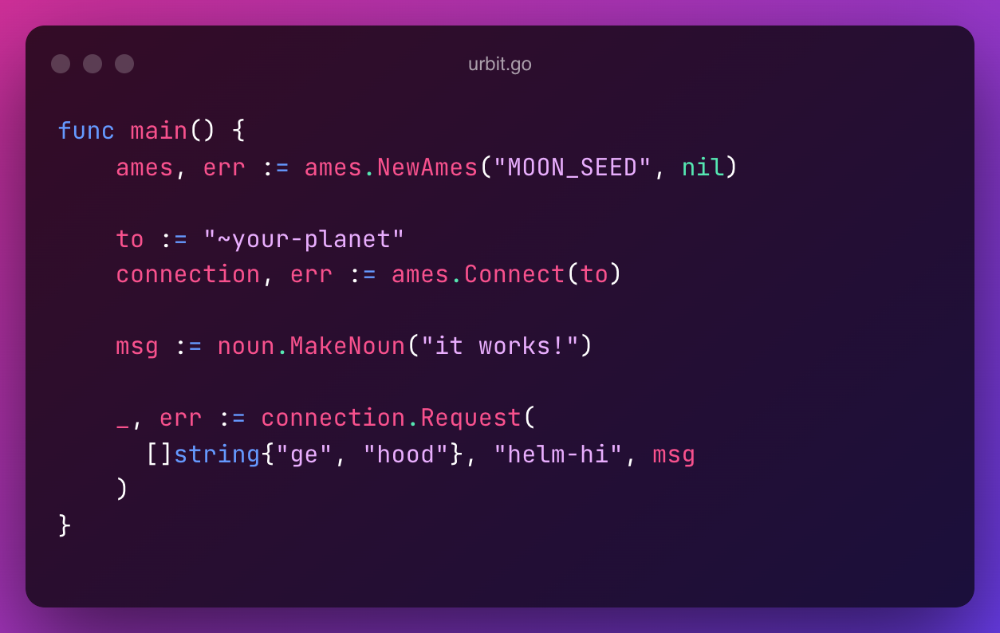

# go-urbit
> golang interface for Urbit

[](https://godoc.org/github.com/stevelacy/go-urbit)



Allows golang applications running as moons to connect to urbit ships over ames.

This can be used by any unix host, including deployed services and IoT projects.


## Ames

### Usage

> Note: each running app _must_ have it's own moon identity. Running on kubernetes or other systems with more than 1 replica per identity will result in odd behavior.

In your Urbit dojo generate a new moon for each connection. The output is the secret key in `@ux` encoding.
```
dojo> |moon
~tabber-finlur-litryl-tadmev
0wnXJXi.~OJWk.4aDRR.....1NEMq.p-00s.2w7U1
```
Convert the key to hex with `` `@ux` `` as follows:
```
dojo> `@ux`0wnXJXi.~OJWk.4aDRR.....1NEMq.p-00s.2w7U1
0x17.eede.d2ff.2b7a.........1022.001c.68c1.a67e.0007.0280.7e01
```

The output value is the seed, or secret key, for your newly created moon.

#### New connection

```go
func main() {
	seed := "the hex seed"

	onPacket := func(c *Connection, pkt Packet) {
		fmt.Println("ames OnPacket", pkt.Data)
	}

	ames, err := NewAmes(seed, onPacket)
	if err != nil {
		panic(err)
	}

	to := "~your-planet"
	connection, err := ames.Connect(to)
	if err != nil {
		panic(err)
	}

	_, err := connection.Request([]string{"ge", "hood"}, "helm-hi", noun.MakeNoun("it works!"))

	if err != nil {
		panic(err)
	}
}
```


## Noun

Most of the common urbit noun functions are available in the `go-urbit/noun` package

```go
import (
	"github.com/stevelacy/go-urbit/noun"
)

func main() {
  n := noun.MakeNoun("string", 1234)
  fmt.Println(n)
}

```


### Installation
> Tested on macos M1


```
brew install openssl pkg-config
```

```
git clone git@github.com:bitcoin-core/secp256k1.git
cd secp256k1
./autogen.sh
./configure --enable-module-recovery --enable-module-extrakeys --enable-module-schnorrsig

make
sudo make install

```

If on macos M1
```
export PATH="/opt/homebrew/opt/openssl@3/bin:$PATH"
export CPPFLAGS="-I/opt/homebrew/opt/openssl@3/include -I/usr/local/include"
export LDFLAGS="-L/opt/homebrew/opt/openssl@3/lib -L/Library/Developer/CommandLineTools/SDKs/MacOSX.sdk/usr/lib -L/usr/local/lib/"
export SDKROOT="/Applications/Xcode.app/Contents/Developer/Platforms/MacOSX.platform/Developer/SDKs/MacOSX.sdk"
export PKG_CONFIG_PATH="/opt/homebrew/opt/openssl@3/lib/pkgconfig"


git clone git@github.com:dfoxfranke/libaes_siv.git
cd libaes_siv
cmake -DCMAKE_PREFIX_PATH=/opt/homebrew/opt/openssl@3 .
make
sudo make install

```


```
export PKG_CONFIG_PATH="/opt/homebrew/opt/openssl@3/lib/pkgconfig"
cd urcrypt/
./autogen.sh
./configure --disable-shared
make
sudo make install
```


#### Testing

```
export MOON_SEED="your seed"

go test ./...
```


~litryl-tadmev
